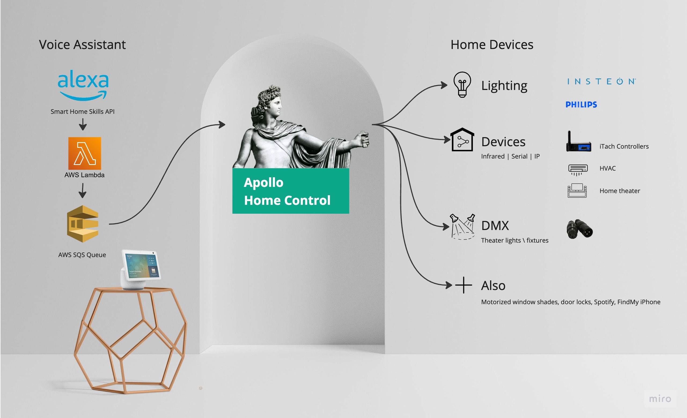
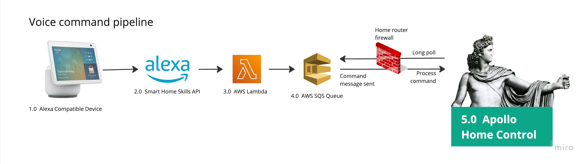
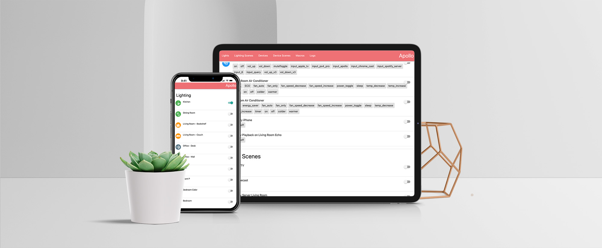

# Apollo Home Control

<u>Overview</u> &nbsp;&nbsp;&nbsp;|&nbsp;&nbsp;&nbsp; [🧭 Installation](./documentation/installation.md) &nbsp;&nbsp;&nbsp;|&nbsp;&nbsp;&nbsp; [🛠️ Maintenance](./documentation/maintenance.md) &nbsp;&nbsp;&nbsp;|&nbsp;&nbsp;&nbsp; [🔮 Roadmap](./documentation/roadmap.md)

*Apollo Home Control offers granular, code-based control of home automation devices. 
Designed for both learning and practicality, it offers a more stripped by approach compared to other popular solutions.*

**Supporting Devices Like**:
- Lights
- Home theater (projectors, receivers)
- HVAC (window air conditioners)
- DMX devices (theater lights)
- Motorized window shades
- Door locks
- Spotify
- Find my iPhone

**Via these ecosystems:**
-  Insteon
-  Phillips Hue
-  Amazon Alexa
-  Apple Find-My
-  Apple Homekit (via Homebridge)
-  GlobalCache iTach (serial, IR, & Contact Closure devices)
-  IP control devices
-  Shelly Plug Modules
-  WLED Modules
-  Spotify

## 🙋‍♂️ Who is this for

- Amateur or pro developers
- DIY'ers & hobbyists who want **code based control** of their smart home device pipeline
- Those who want to **learn** how these systems work and communicate rather than just adopting a complex library
- Curious developers interested in understanding a stripped down approach

This isn't you? See: [Recommended options for other audiences](./documentation/homeAutomationOptions.md)

## 🕰️ Background

I've been a home automation enthusiast for nearly 20 years (since X10 ruled) and started this project after becoming frustrated that a number of the commercial & open-source solutions were inflexible, buggy, and unnecessarily complex. Developing my own solution was a great way to have unlimited control, better understand my devices, and improve my programming skills with a fun & practical project. The result was a solution that had near bulletproof reliability and required additional effort only when I made hardware changes.

## 🎛️ Capabilities & Features

### Alexa Voice Control

> [!IMPORTANT] 
> Deploy [Apollo Alexa Skill](https://github.com/raypp2/Apollo-Alexa-Skill) application for voice control via Alexa.

Voice is the primary mechanism of controlling my smart home. With the exception of room specific hardware switches (i.e. light switches), voice offers a better UX for both owners and guests than almost any other approach.

I remember the days of universal remotes where having to look through dozens of buttons and sequences could make if difficult to perform even the most simple tasks. The best interface is no interface. Short of telepathy, voice is the most intuitive and fast control surface. 

Popular home automation platforms like Home Assistant are begining to incorporate these features but it's a surprisingly difficult challenge with big brands far out front.

Smart home control was a feature of Amazon's Alexa Echo v1 with local control of Phillips Hue devices. The first version of my application used a local emulation of this protocol that pretended to be a Phillips Hue Bridge. A limitation was the voice invocation model where control of other device types could feel unnatural. For example "Alexa, turn ON the air conditioner colder" instead of "Alexa, make the living room colder" or "Alexa, reduce the temperature in the living room."

Far more robust control has been enabled via the [Alexa Smart Home Skill API](https://developer.amazon.com/en-US/docs/alexa/smarthome/understand-the-smart-home-skill-api.html). This version of the application uses the following command pipeline:

This pipeline uses a [sibliing application](https://github.com/raypp2/Apollo-Alexa-Skill) that runs on AWS Lambda. While it would be possible to sent commands directly to the local Apollo Home Control instance, that would require opening up a port inside the home network and managing the security considerations. Lambda is reasonably fast, free at low execution volumes, and well integrated with the Alexa Smart Home Skill API.

### HTML Front-End

The HTML front-end provides a control surface that auto-generates a list of all devices and commands. I rarely use this myself, except for testing and control during internet outages. It can be accessed via:

http://apollo.local or the device's IP address

I haven't designed customization capabilities because better options exist and could be easily integrated from Alexa, Apple Homekit, and 3rd party dashboards.

### HTML Based Endpoint

The API endpoint, used by the Alexa bridge system, offers complete control capabilities. All commands are processed via GET and parameters sent within the URL in the following scheme:

http:// `server-address` /api/ `module` /  `device`  /  `command`  /  `parameter`  /  `parameter`

Modules include:
- `LIGHTS`  Individual lighting devices
- `DEVICES` Individual other devices
- `LIGHTINGSCENES` Groups of lights via scene controllers of their respective ecosystems
- `DEVICESCENES` Groups of video & audio devices with inputs
- `MACROS` Sequences of commands in the same API format
- `SPEAKERS` Audio device volume control
- `AC` Air conditioner temperature & mode control
- `LOCKS` Lock device controls

The commands and associated parameters will vary per module. Further documentation is available within the code comments.

## 🔮 The Future

For my existing hardware, this is still a great solution that I will continue to improve. The [Roadmap](./documentation/roadmap.md) details possible improvements.

With Matter & Thread on the horizon and ecosystems from major brands getting significantly better, I will likely start to migrate to commercial systems as existing systems break or as I bring in new hardware. 

I expect another 10 years of life for this system in my circumstance.

#### Acknowledgements

Device mockup backgrounds: by rezaazmy / Freepik