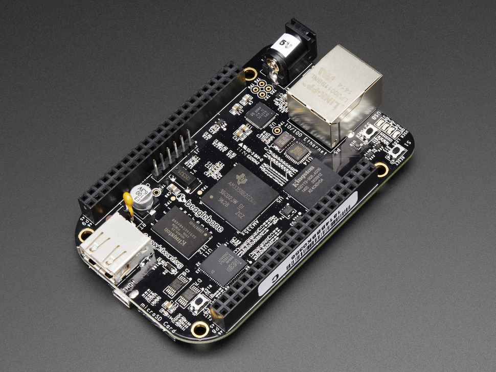

[Overview](../README.md) &nbsp;&nbsp;&nbsp;|&nbsp;&nbsp;&nbsp; [🧭 Installation](./installation.md) &nbsp;&nbsp;&nbsp;|&nbsp;&nbsp;&nbsp; [🛠️ Maintenance](./maintenance.md) &nbsp;&nbsp;&nbsp;|&nbsp;&nbsp;&nbsp; [🔮 Roadmap](./roadmap.md)

# BeagleBone Microcontroller



For my server, I use a [BeagleBone Black Rev C - 4GB](https://www.adafruit.com/product/1876), circa 2014 from Adafruit. This board has operated with no issues at all in that entire span without any issue or degradation in performance. It is discontinued. Below are instructions for how I had set it up.

## Latest Steps

1) Download the latest version [Debian distro](https://www.beagleboard.org/distros)
2) Flash to an SD card with [Balena Etcher](https://www.balena.io/etcher/)
3) Insert the card and boot to the CD by holding the boot button ([Instructional Video](https://www.youtube.com/watch?v=_nPj1cCFrRk))
4) SSH into the OS being run from the SD card
5) Run

	`sudo nano /boot/uEnv.txt`

6) Remove the comment (#) on the last line

	`cmdline=init=/opt/scripts/tools/eMMC/init-eMMC-flasher-v3.sh`

7) Close (Ctrl + X) and save (Enter)
8) Run

	`sudo shutdown -h now`

9) Reboot to the SD card with the same process
10) Lights will move in a side to side pattern when it has started flashing and then shut off the device when complete.
11) Remove the SD card and power cycle
12) SSH into the OS now being run from the on-board memory
13) Change password with command:

	passwd

14) [Install](https://deb.nodesource.com/) latest Node JS
15) Disable services that use port 80. In this distro, it was:

```bash
sudo systemctl disable nginx
sudo systemctl stop nginx
```


## Old Steps

1) Update to latest distro via Sd Card
		https://learn.adafruit.com/beaglebone-black-installing-operating-systems/mac-os-x
		http://beagleboard.org/latest-images
		Use non-GUI version

2) Disable services that use port 80
	https://www.element14.com/community/community/designcenter/single-board-computers/next-gen_beaglebone/blog/2013/11/20/beaglebone-web-server--setup 

3) Install the latest stable Node JS
	https://nodejs.org/en/download/package-manager/#debian-and-ubuntu-based-linux-distributions

#### ... AFTER ALL OTHER CONFIGURATION STEPS:

4) Write SD card image to eMMC
		Navigate to /opt/scripts/tools/eMMC/ and run the file manually...
		sudo ./init-eMMC-flasher-v3.sh